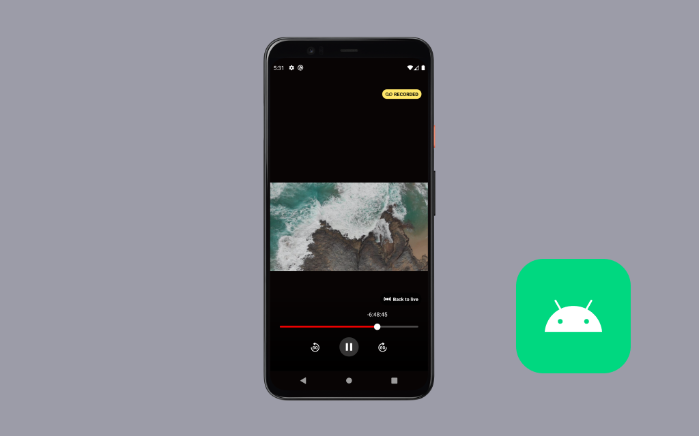

# Amazon IVS Live to VOD (DVR) Android demo

This Android demo application is intended as an educational tool for demonstrating how you can implement a Live to VOD (DVR) experience using [Amazon IVS](https://aws.amazon.com/ivs/) and the auto-record-to-s3 feature using [Amazon S3](https://aws.amazon.com/s3/).

At a high level, it allows a viewer to seek back in time during a live stream and view recorded content from that stream. Viewers are also able to jump back to the live stream and resume watching content that is live.

## Setup

### 1. Using your own stream (optional)

In order to use your own stream with this demo you will need to deploy a backend solution on your AWS account. To do so, clone [amazon-ivs-dvr-web-demo](https://github.com/aws-samples/amazon-ivs-dvr-web-demo) and follow the deployment instructions available in the README.

Note that this solution will:

- Create an Amazon IVS channel
- Set up auto-record-to-S3 for that channel
- Create Lambda and Lambda@Edge resources to process VOD content
- Create a CloudFront distribution to serve the VOD content

Once deployment is done the CDK will output `distributionDomainName` that you'll need on the following step to run the demo

### 2. Run demo

1. Clone the repository to your local machine.
2. Open the cloned repository in [Android Studio](https://developer.android.com/studio), or an IDE of your choice.
3. To use the backend created in Step 1, open `app/build.gradle` and edit Line 17 replacing `https://d328da4i6b8le0.cloudfront.net` with the `distributionDomainName` value from Step 1.
4. Run the application on an emulated device or a physical device running API level 29 or later.

## About Amazon IVS

Amazon Interactive Video Service (Amazon IVS) is a managed live streaming solution that is quick and easy to set up, and ideal for creating interactive video experiences. [Learn more](https://aws.amazon.com/ivs/).

- [Amazon IVS docs](https://docs.aws.amazon.com/ivs/)
- [User Guide](https://docs.aws.amazon.com/ivs/latest/userguide/)
- [API Reference](https://docs.aws.amazon.com/ivs/latest/APIReference/)
- [Setting Up for Streaming with Amazon Interactive Video Service](https://aws.amazon.com/blogs/media/setting-up-for-streaming-with-amazon-ivs/)
- [Learn more about Amazon IVS on IVS.rocks](https://ivs.rocks/)
- [View more demos like this](https://ivs.rocks/examples)

## Security

See [CONTRIBUTING](CONTRIBUTING.md#security-issue-notifications) for more information.

## License

This project is licensed under the MIT-0 License. See the [LICENSE](LICENSE) file.
